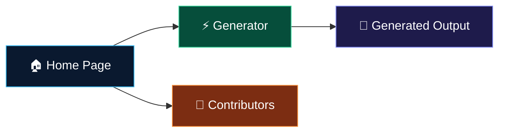
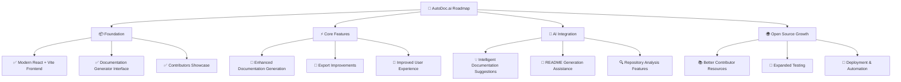

<div align="center">


<br/>

### ✨ Crafting Professional Documentation with AI Precision

<p><strong>An open-source developer tool that automatically generates high-quality READMEs, CONTRIBUTING guides, and API documentation — so your code finally gets the docs it deserves.</strong></p>

<br/>

<div align="center">

[](https://github.com/abhro05/AutoDoc.ai/graphs/contributors)
[](https://github.com/abhro05/AutoDoc.ai/network/members)
[](https://github.com/abhro05/AutoDoc.ai/stargazers)
[](https://github.com/abhro05/AutoDoc.ai/issues)
[](https://github.com/abhro05/AutoDoc.ai/pulls)
[](./LICENSE)

</div>

<br/>

<a href="#-about-autodocai">About</a> •
<a href="#️-setup-instructions">Setup</a> •
<a href="#-system-architecture">Architecture</a> •
<a href="#-project-structure">Structure</a> •
<a href="#️-tech-stack">Tech Stack</a> •
<a href="#️-roadmap">Roadmap</a> •
<a href="#-contributing">Contributing</a> •
<a href="#-license-and-maintainer">License</a>

</div>

---

## 📖 About AutoDoc.ai

> **"Because great code deserves great documentation."**

Every developer knows the feeling — you've just shipped an amazing project, but the documentation is either missing, outdated, or consists of three bullet points and a TODO comment. **AutoDoc.ai** was built to solve exactly this problem.

**AutoDoc.ai** is an intelligent, open-source documentation engine that deeply analyzes your repository structure and source code to generate comprehensive, structured, and production-ready documentation — automatically. It respects developer autonomy by keeping humans firmly in control through live previews and manual editing, while the AI handles the heavy lifting.

Whether you're preparing a project for an open-source hackathon, a job portfolio, or a collaborative team environment, AutoDoc.ai ensures your repository makes the best possible first impression.

### 🌟 Key Features

| Feature                     | Description                                                                                        |
| :-------------------------- | :------------------------------------------------------------------------------------------------- |
| 🔍 **Deep Repo Analysis**   | Scans repository structure, configuration files, and code patterns for comprehensive understanding |
| ⚡ **Instant Generation**   | Creates README.md, CONTRIBUTING.md, and API docs in seconds, not hours                             |
| 🌐 **API Documentation**    | Dedicated support for REST API endpoint documentation generation                                   |
| 👁️ **Live Preview**         | React-based real-time markdown preview with inline manual editing                                  |
| 📤 **Export Ready**         | One-click export producing clean, production-ready documentation files                             |
| 🤖 **AI-Powered Accuracy**  | Gemini API integration for context-aware, intelligent content generation                           |
| 🧩 **Modular Architecture** | Three-layer design enabling easy extension and customization                                       |
| 🔓 **100% Open Source**     | MIT Licensed — free for personal, academic, and commercial use                                     |

---

## ⚙️ Setup Instructions

> [!IMPORTANT]
> Ensure you have **Node.js v18 or later** installed before getting started.

### 1. Clone the Repository

```bash
git clone https://github.com/abhro05/AutoDoc.ai.git
cd AutoDoc.ai
```

### 2. Install Dependencies

```bash
npm install
```

### 3. Start the Development Server

```bash
npm run dev
```

The application will be available at:

```text
http://localhost:3000
```

### 4. Build for Production

```bash
npm run build
```

### 5. Preview the Production Build

```bash
npm run preview
```

> [!TIP]
> If you encounter dependency-related issues, delete `node_modules` and `package-lock.json`, then run `npm install` again.

---

## 🔄 System Architecture

AutoDoc.ai currently follows a lightweight client-side architecture built with React and Vite. The application is organized into reusable pages and components, providing a fast and responsive user experience while maintaining a clean and scalable codebase.

```text
                                        ┌─────────────────────────────────────────────┐
                                        │                User Browser                 │
                                        │                                             │
                                        │        React + Vite Frontend App            │
                                        │                                             │
                                        │  Home Page → Generator → Contributors       │
                                        └─────────────────────────────────────────────┘
```

### Application Flow



### Architecture Overview

| Layer            | Technology       | Responsibility                                     |
| :--------------- | :--------------- | :------------------------------------------------- |
| **Frontend**     | React 18 + Vite  | User interface, routing, and application rendering |
| **Pages**        | React Components | Home, Generator, and Contributors views            |
| **Styling**      | CSS3             | Responsive layout and visual design                |
| **Build System** | Vite             | Development server and production builds           |

> [!NOTE]
> The project architecture is designed to evolve over time, with future plans including AI-powered documentation generation, backend integrations, and expanded automation capabilities.

---

## 📁 Project Structure

```text
AutoDoc.ai/
│
├── .github/
│   └── ISSUE_TEMPLATE/
│       ├── ❄️-feature-request.md
│       ├── 🐛-bug-report.md
│       ├── 💬-general---blank-issue.md
│       └── 📝-documentation-update.md
│
├── src/
│   ├── main.jsx                    # React application entry point
│   │
│   ├── pages/
│   │   ├── App.jsx                 # Application routing and layout
│   │   ├── Home.jsx                # Landing page
│   │   ├── Generator.jsx           # Documentation generator interface
│   │   └── Contributors.jsx        # Contributors showcase page
│   │
│   └── styles/
│       ├── home.css                # Home page styling
│       ├── Generator.css           # Generator page styling
│       └── Contributors.css        # Contributors page styling
│
├── index.html                      # Main HTML template
├── package.json                    # Project metadata and dependencies
├── package-lock.json               # Dependency lock file
├── vite.config.js                  # Vite configuration
├── README.md                       # Project documentation
├── LICENSE                         # MIT License
└── autodoc.png                     # Project logo and branding
```

---

## 🛠️ Tech Stack

AutoDoc.ai is built with a modular, scalable architecture across three specialized layers.

### 🌐 Frontend Layer

**React**: A React-based web interface for repository input and real-time previews.
**Languages**: Built using HTML, CSS, and JavaScript for a responsive experience.
**Markdown Preview**: Supports real-time preview and manual editing of generated content.

### ⚙️ Backend Layer

**Node.js & Express**: A robust server that orchestrates all GitHub API interactions.
**GitHub REST API**: Deeply integrates with GitHub to parse repository files and structures.

### 🤖 AI Service Layer

**Python Microservice**: A dedicated microservice for intent detection and code summarization.
**Gemini API**: Leverages advanced AI to generate structured, high-quality documentation text.

### 🎨 Technology Badges

<div align="center">

| Category                | Badges                                                                                                                                                                                                                                                   |
| :---------------------- | :------------------------------------------------------------------------------------------------------------------------------------------------------------------------------------------------------------------------------------------------------- |
| **Frontend Foundation** |    |
| **Core**                |    |
| **Integrations**        |                                                                                |

</div>

---

## 🗺️ Roadmap

AutoDoc.ai is continuously evolving to provide a better documentation experience for developers and open-source contributors.



### Current Progress

```text
Foundation               ████████████████████  Complete ✅
Core Features            ██████████░░░░░░░░░░  In Progress 🚧
AI Integration           ███░░░░░░░░░░░░░░░░░  Planned 📋
Open Source Growth       ██░░░░░░░░░░░░░░░░░░  Future 💡
```

### Planned Improvements

#### 🎨 User Experience

- [ ] Improve UI responsiveness across devices
- [ ] Enhance accessibility and usability
- [ ] Refine navigation and page layouts

#### 📄 Documentation Features

- [ ] Improve generated documentation quality
- [ ] Add additional export options
- [ ] Expand customization capabilities

#### 🤖 AI-Powered Enhancements

- [ ] Intelligent documentation assistance
- [ ] Repository structure analysis
- [ ] Context-aware content suggestions

#### 🌐 Open Source Development

- [ ] Increase test coverage
- [ ] Improve contributor onboarding
- [ ] Add automated workflows and CI/CD support
- [ ] Expand community-driven contributions

---

## 🌟 Contributing

AutoDoc.ai thrives because of contributors like you. Whether you're fixing a typo, building a feature, or improving AI prompts — every contribution matters and is recognized.

### 🏆 Open Source Programs

| Program                                                                                   | Event                     | Timeline    | Status    |
| :---------------------------------------------------------------------------------------- | :------------------------ | :---------- | :-------- |
|  | **Social Summer of Code** | Summer 2026 | 🟢 Active |

> [!NOTE]
> AutoDoc.ai is an **SSOC-selected project**. Contributing during the program window earns you official SSOC points, certificates, and recognition on the leaderboard. All accepted PRs during the event will be labeled `ssoc`.

### 🚀 How to Get Involved

We're currently in the **Open Source Readiness** phase and actively welcoming contributors of all skill levels.

#### For Beginners 🌱

- Fix typos, grammar, or formatting in documentation
- Add missing code comments or docstrings
- Improve error messages for better developer experience
- Write or improve existing tests

#### For Intermediate Contributors 🌿

- Implement documentation quality scoring
- Add support for additional AI providers (OpenAI, Cohere, etc.)
- Improve GitHub API rate-limit handling and caching
- Build new export formats (PDF, HTML, Notion)

#### For Advanced Contributors 🌳

- Design the GitHub App integration (Phase 3)
- Architect the plugin system (Phase 4)
- Implement PR-based documentation suggestion workflows
- Build the community prompt template marketplace

### 🛤️ Contribution Workflow

```bash
# 1. Fork the repository on GitHub

# 2. Clone your fork
git clone https://github.com/YOUR_USERNAME/AutoDoc.ai.git
cd AutoDoc.ai

# 3. Create a descriptive feature branch
git checkout -b feat/your-feature-name
# or: fix/bug-description | docs/update-section | test/add-coverage

# 4. Make your changes with clear, atomic commits
git commit -m "feat: add documentation quality scoring UI"

# 5. Push and open a Pull Request
git push origin feat/your-feature-name
```

### 📋 Pull Request Checklist

Before submitting your PR, ensure:

- [ ] Code follows the existing style conventions
- [ ] New features include appropriate tests
- [ ] Documentation is updated to reflect changes
- [ ] The PR description clearly explains **what** and **why**
- [ ] All existing tests pass locally
- [ ] No sensitive data (API keys, tokens) is committed

> [!TIP]
> Read the full **[CONTRIBUTING.md](./CONTRIBUTING.md)** for detailed environment setup, coding standards, commit message conventions, and pull request guidelines.

### 🏅 Contributor Recognition

All contributors are featured on our Contributors page and in the project README. Significant contributors will be recognized with special badges and invited to join the maintainer team.

---

## 📄 License and Maintainer

### 📜 License

This project is licensed under the **[MIT License](./LICENSE)**.

The MIT License ensures AutoDoc.ai remains **forever free and open** — use it in your academic projects, hackathons, startup products, or enterprise workflows without restriction. We only ask that you keep the license notice intact and consider contributing improvements back to the community.

```
Copyright (c) 2026 Abhro

Permission is hereby granted, free of charge, to any person obtaining a copy
of this software and associated documentation files (the "Software"), to deal
in the Software without restriction...
```

### 👨‍💻 Maintainer

<div align="center">

<br/>


<br/>

**❄️ Abhro**
_Full-Stack Developer · Data Science Specialization_

_Building tools that make developers' lives easier, one commit at a time._

<br/>

[](https://github.com/abhro05)
[](https://www.linkedin.com/in/mayurpagote)

<br/>

</div>

---

<div align="center">

**Made with ❤️ by the AutoDoc.ai community**

_"Because great code deserves great documentation."_

<sub>© 2026 AutoDoc.ai · MIT Licensed · Open Source Forever</sub>

</div>
