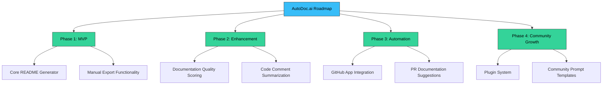

<div align="center">
  

  ### ✨ Crafting Professional Documentation with AI Precision

  <p>An open-source developer tool that automatically generates high-quality READMEs, CONTRIBUTING guides, and API documentation.</p>

  <div align="center">
    
    
    
    
    
  </div>
</div>

---

# 📖 About AutoDoc.ai
**AutoDoc.ai** addresses the challenge of outdated documentation due to time constraints. It analyzes repository structures and source code to generate structured content while keeping humans in control via manual editing and previews.

### 🌟 Key Features
- **Repo Analysis**: Deep scanning of repository structure and configuration files.
- **Automatic Generation**: Instant creation of README.md and CONTRIBUTING.md files.
- **API Support**: Dedicated documentation generation for API endpoints.
- **Live Preview**: React-based markdown preview with manual editing capabilities.
- **Export Ready**: One-click export for production-ready documentation files.

---

# ⚙️ Setup Instructions

> [!IMPORTANT]
> Ensure you have your Gemini API and GitHub tokens ready before starting the services.

### 1. Installation Steps
```diff
+ git clone [https://github.com/abhro05/AutoDoc.ai.git](https://github.com/abhro05/AutoDoc.ai.git)
+ cd AutoDoc.ai

# Frontend Setup
+ cd frontend && npm install

# Backend Setup
+ cd ../backend && npm install

# AI Service Setup
+ cd ../ai_service && pip install -r requirements.txt
```
# 🔄 System Architecture
The system utilizes a modular three-layer architecture to manage the documentation workflow
- Frontend: React web interface for URL input and previews
- Backend: Node.js/Express server orchestrating GitHub API interactions
- AI Service: Python microservice integrating with Gemini API to summarize code
- Data Flow: User → React UI → Node.js Backend → Python AI Service → Node.js Backend → React UI

``` mermaid
graph LR
    A[React UI] -- Repo URL --> B[Node.js Backend]
    B -- Parse Files --> C[Python AI Service]
    C -- Summarization --> D[Gemini API]
    D -- Doc Content --> C
    C -- Markdown --> B
    B -- Preview --> A
    
    style A fill:#0A192F,stroke:#333
    style B fill:#064E3B,stroke:#333
    style C fill:#0A192F,stroke:#333
    style D fill:#064E3B,stroke:#333
```

## 🛠️ Tech Stack

AutoDoc.ai is built with a modular, scalable architecture across three specialized layers.

### 🌐 Frontend Layer
**React**: A React-based web interface for repository input and real-time previews.
**Languages**: Built using HTML, CSS, and JavaScript for a responsive experience.
**Markdown Preview**: Supports real-time preview and manual editing of generated content.

### ⚙️ Backend Layer
**Node.js & Express**: A robust server that orchestrates all GitHub API interactions.
**GitHub REST API**: Deeply integrates with GitHub to parse repository files and structures.

### 🤖 AI Service Layer
**Python Microservice**: A dedicated microservice for intent detection and code summarization.
**Gemini API**: Leverages advanced AI to generate structured, high-quality documentation text.


### 🎨 Technology Badges

<div align="center">

| Category | Badges |
| :--- | :--- |
| **Frontend Foundation** |    |
| **Core** |    |
| **Integrations** |   |

</div>


---

#  🗺️ Roadmap

## 📅 Implementation Milestones

### 🏗️ Milestone 1: Project Setup
- [ ] Repository initialization.
- [ ] Basic React frontend setup.
- [ ] Node.js backend scaffolding.

### 🔍 Milestone 2: Repository Analysis
- [ ] GitHub API integration.
- [ ] File structure parsing.

### 🤖 Milestone 3: AI Integration
- [ ] Python microservice setup.
- [ ] Gemini API prompt design.

### ✍️ Milestone 4: Documentation Generation
- [ ] README and CONTRIBUTING generation.
- [ ] Markdown preview and editing interface.

### 🚀 Milestone 5: Quality and Expansion
- [ ] API documentation support.
- [ ] Architecture summaries.


### 🌐 Milestone 6: Open Source Readiness
- [ ] Comprehensive tests and linting.
- [ ] Project documentation and examples.

---
# 🌟 Participation and Contributing

AutoDoc.ai is built to promote best practices in documentation and modular system design while attracting contributors of all skill levels. The project is designed to be a high-impact, scalable tool for the open-source community.

### Open Source Programs

| Program | Name | Timeline |
| :--- | :--- | :--- |
| **Resourcio Community** | Aperture 3.0 | Jan 1 – March 1, 2026 |

### How to Get Involved

We are currently in the **Open Source Readiness** phase, focusing on comprehensive testing and clear examples. You can contribute by:

1. **Forking** the repository and creating a feature branch.
2. **Improving AI Prompts**: Help refine the Gemini API prompt designs for better documentation accuracy.
3. **Enhancing Features**: Contribute to the development of documentation quality scoring or code comment summarization.
4. **Building the Community**: Help us reach **Phase 4** by designing plugin systems or community prompt templates.

> [!TIP]
> Read our full **[CONTRIBUTING.md](./CONTRIBUTING.md)** for detailed environment setup and pull request guidelines.


---

# 📄 License and Maintainer

### License
This project is licensed under the **MIT License**. This ensures the tool remains open and accessible for academic projects, hackathons, and long-term community development.

### Maintainer
<div align="center">
  <p>
    <strong>❄️Abhro</strong><br>
    <em>Full-Stack Developer | Data Science Specialization</em>
  </p>
  <p>
    <a href="https://github.com/abhro05">
      
    </a>
    <a href="https://www.linkedin.com/in/mayurpagote">
      
    </a>
  </p>
  <p><sub>"Because great code deserves great documentation."</sub></p>
</div>

---
